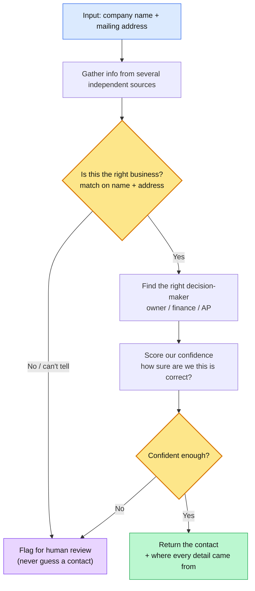

# PLAN.md

What to achieve: 

A logistics company has onboarded ~1,000 unpaid small-business accounts. For each account we have only two fields: the company name and mailing address. No owner name, no email, no phone.

The goal is to find the right decision-maker at each business (owner, CFO, AP manager, office manager) and surface a reachable contact so the collections team can drive payment. Not every contact can be found, and handling "I cannot verify this" honestly matters as much as the contacts we do find. A confident but wrong contact is worse than no contact at all.

This system takes the CSV, cross-references multiple independent sources per row, scores how sure we are about what we found, and returns either a trustworthy contact or an honest "needs human review" flag. It never guesses.

---

## Architecture

A per-row enrichment pipeline. Each company flows through fixed stages, with a **provenance spine** running through all of them, so every value I emit is traceable to a source.

**Pipeline stages:**

1. **Ingest & normalize:** parse the mailing address into components; normalize the company name carefully (no blind legal-suffix stripping, which is itself a false-positive source); derive a rough **size prior** from the business name / trade type; emit an ambiguity flag where resolution is uncertain.
2. **Multi-source enrichment (cheap-first, short-circuit):** query sources in cost order, free / authoritative first (registry), escalating to paid enrichment only if I don't yet have a gated, confident contact. Stop enriching a row the moment its confidence clears the bar. This keeps cost down at scale and, as a side effect, reduces exposure to the weakest / guessiest provider.
3. **Layer 1: Entity gate (runs first, logically prior).** Confirm I have the *right business* using company name + address only. This is the false-positive firewall; nothing downstream runs until it passes.
4. **Layer 2: Person / contact (only if the gate opens).** Identify the decision-maker and a reachable contact for the confirmed entity.
5. **Confidence & decision:** combine signals into a 0-100 score, then route via a threshold band.
6. **Output:** one structured row per input company, with provenance.

---

## Sources & strategy

I combine source *families* by independence lineage, because corroboration only means something when the agreeing sources are genuinely independent (many business-data sources recycle the same feeds, which manufactures false agreement):

- **Government / official:** state business registries, professional licensing boards. Highest authority, often name the owner, but coverage is patchy for tiny businesses and they rarely give email.
- **Company's own footprint:** website contact page, domain WHOIS. Independent of directories, but many micro-businesses have none.
- **Directories / listings:** Google Business, Yelp, BBB. Good for phone; treat as a *single* family for corroboration since they cross-ingest each other.
- **Professional networks:** LinkedIn for owner / office manager. Useful but thin for micro-businesses and privacy-sensitive.

**Failure modes:** registries missing for small shops; listings recycled (false corroboration); enrichment-style guesses that look precise but are unverified. **Strategy:** a contact corroborated across two *different families* outranks any single fancy source; corroboration within one family doesn't count.

---

## Quality

- **Entity resolution / dedupe:** anchor on company name **+ address**. The address is the disambiguator that separates a local business from a same-named chain: the core guard against the "right name, wrong company" false positive.
- **Confidence model, a gate plus caps plus additives, not a flat sum:**
  - *Gate (entity):* Strong (name + exact address agree across independent sources) / Medium (same city, different street) / Fail (different city or state, reject) / Cannot-verify (nothing ties name to address, human review). Runs first.
  - *Caps (ceiling the score regardless of everything else):* single source / generic contact (no named decision-maker) / gate only Medium.
  - *Additives (graded, only after the gate passes and no cap fires):* source authority; role / decision-maker match (asymmetric: a confirmed role boosts strongly, missing role info is only a mild discount; and size-conditional: ignore role for very small shops, drop it when size is unknown); corroboration depth.
  - Weights kept coarse and calibrated against worked examples, not invented precision.
- **Provenance:** every emitted field carries its source. I never emit a contact I can't attribute to at least one source.
- **"Cannot verify" is a first-class output** -> `needs_human_review = true` with an empty contact, never a fabricated one. A well-handled miss counts as success, not failure.
- **False-positive risk** is addressed structurally: gate-before-person ordering, the single-source and generic-contact caps, and a standing preference for "I can't verify this" over a plausible guess.

---

## Privacy / compliance

- **I will:** use business-level public / official records (registries, licensing, business listings); carry provenance on everything; route uncertain rows to human review.
- **I will NOT:** scrape personal social profiles for personal data, guess-and-send to fabricated personal emails, or emit any contact I can't attribute to a source.
- **Default posture:** business-level data only unless explicitly cleared for more. Treat sole-proprietor personal data with extra care (CCPA-type exposure), since for a collections use case, sourcing a contact from the wrong place is a compliance and reputational problem, not just a quality one.

---

## Operational considerations

Deliberately *not* a scaling section: at ~1,000 rows this is a small batch job, and optimizing throughput would be solving a problem I don't have. The properties that actually matter here:

- **Auditability:** every emitted value carries its source, so any contact can be justified after the fact. For a collections use case that's a requirement, not a nice-to-have.
- **Graceful degradation:** a missing or unavailable source doesn't fail the row; it becomes "not found from that source" (with per-source timeouts so a slow source can't stall a row), and the row is scored on what remains.
- **Reproducibility:** re-running enrichment yields the same traceable result, keeping the audit trail and the human-review queue consistent.
- **Real-world bottleneck (off the mocks):** not compute, but source rate limits, per-lookup cost, and terms-of-service. Handled with caching, backoff, and the cheap-first / short-circuit query order above, not more machines. The human-review queue has its own throughput ceiling, which is exactly why I default to precision over coverage: flagging too aggressively would drown the reviewers.
- **Out of scope, on purpose:** throughput / latency tuning and horizontal scaling, because the dataset is small and the real constraints are rate-limits, cost, and review capacity, not processing speed.

---

## Clarifying questions

**1. Precision vs. coverage.** Which is the more expensive mistake for this client: contacting the *wrong* person, or *failing* to surface a contact at all? I.e. do you want maximum coverage (reach as many accounts as possible, tolerating some wrong contacts) or maximum precision (only surface confident contacts, accepting that many come back as needs-review)?
- *Why it matters:* it defines what "good output" even is, and my whole design currently assumes precision.
- *Default if unanswered:* optimize for precision, since a wrong contact costs more than a missed one in a collections context.
- *What changes:* if you want coverage, it's a rebuild, not a tweak: loosen the entity gate, drop the "too weak -> discard" band, soften the single-source and generic-contact caps into discounts, and lower the auto-accept line. The system flips from "refuse when unsure" to "surface-with-a-flag when unsure."

**2. Persona.** Should the agent target whoever controls payment (owner included), or specifically a finance/AP role-holder, where an owner would not count for a larger company?
- *Why it matters:* "the right person" maps to different people by company size, so without this I can't decide whether a confidently-found owner is a valid contact or one I should reject, and that's not a call I can make alone.
- *Default if unanswered:* size-conditional, rely on the owner for small shops, target AP/Finance for larger ones; if size is unknown, fall back to owner and flag.
- *What changes:* if title-agnostic, my current design stands. If a finance/AP role is required, role flips from a soft weight to a hard gate, and an owner found at 90 confidence still routes to `needs_human_review`.

**3. Allowed sources.** Are we permitted to use personal data on individuals (LinkedIn profiles, personal emails/addresses), or must we stay to business-level public / official records?
- *Why it matters:* it decides what data I'm even allowed to touch, which reshapes my whole source set, and sourcing from the wrong place is a compliance exposure, not just a quality issue.
- *Default if unanswered:* business-level public / official sources only (registry, business listings); no scraping personal profiles.
- *What changes:* if personal data is allowed, the LinkedIn / individual family opens up, giving a bigger corroboration pool and more confirmed contacts, but more privacy exposure. If business-level only, that family is cut, corroboration leans on registry + listings, and more rows fall to cannot-verify / human review.
